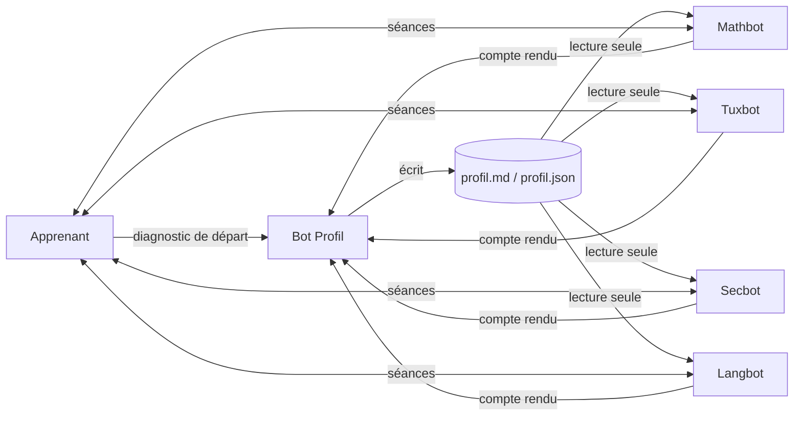

# Grok Bot Academy : une petite boucle agentique pour apprendre

Grok Bot Academy est un prototype de tutorat par agents IA. Un **bot Profil** mesure ton niveau dans
chaque domaine, et des **bots profs** t'enseignent. Après chaque séance, chaque prof envoie
un compte rendu au bot Profil, qui met le profil à jour. Les profs relisent ce profil pour
adapter la séance suivante.

C'est un prototype, pas un produit fini. Essaie-le, casse-le, améliore-le.

## La boucle

1. **Première interaction** : le bot Profil pose des questions, un domaine à la fois, et attribue un niveau de départ.
2. **Séance** : le prof lit le profil, propose un objectif, une explication courte, des exercices, une correction, un point à retenir.
3. **Compte rendu** : à la fin, le prof envoie au bot Profil un résumé court (thèmes vus, réussites, erreurs récurrentes, difficultés, niveau estimé, prochaine étape).
4. **Mise à jour** : le bot Profil valide les changements de niveau et réécrit le profil. Lui seul écrit dans le profil.

## Contenu du dépôt

- `ARCHITECTURE.md` : rôles, règles et choix de conception.
- `prompts/` : les prompts des 5 bots (Profil, Mathbot, Tuxbot, Secbot, Langbot), génériques.
- `shared/profil.example.json` et `shared/profil.example.md` : format du profil partagé.
- `CONTRIBUTING.md` : comment proposer une amélioration.

## Le monter chez toi

Le concept est indépendant de la plateforme : il suffit de pouvoir faire tourner plusieurs
agents LLM qui partagent un dossier et peuvent s'envoyer des messages.

1. Crée 5 agents, un par fichier de `prompts/`, avec le prompt comme consigne.
2. Mets un dossier partagé lisible par tous (par exemple `skillverse/`), avec une copie des fichiers de `shared/`.
3. Donne au bot Profil seul le droit d'écrire dans `profil.md` et `profil.json`.
4. Permets aux profs d'envoyer un message au bot Profil (outil de messagerie entre agents, file de messages, webhook, ou simple fichier de comptes rendus).
5. Lance le diagnostic avec le bot Profil, puis une séance avec un prof.

Les prompts sont écrits pour des agents qui peuvent s'écrire entre eux. Si ta plateforme ne le
permet pas, remplace l'envoi du compte rendu par l'écriture d'un fichier `comptes-rendus/` que le bot Profil relit.

## Choix importants

- **Un seul écrivain** pour le profil, pour éviter les contradictions.
- **Aucune invention** : un niveau ou un résultat n'existe que s'il vient d'une réponse ou d'un compte rendu réel.
- **Modèles gratuits d'abord** : le concept est pensé pour tourner sur des quotas gratuits.
- **Cybersécurité défensive** : le prof de cybersécurité n'enseigne la pratique offensive que sur des environnements légaux (labs, CTF, machines de test). Jamais de scan ou d'attaque de systèmes tiers.
- **Bac à sable** pour les exercices de commande (Linux), jamais sur la machine de l'apprenant.

## Idées d'amélioration

- Échelle de niveaux plus fine et sous-compétences par domaine.
- Révisions espacées : le bot Profil planifie les rappels.
- Nouveaux profs (code, finance, sciences) : la boucle est la même.
- Évaluation automatique de la qualité des corrections.
- Interface web légère par-dessus le profil partagé.

## Licence

MIT. Voir `LICENSE`.
